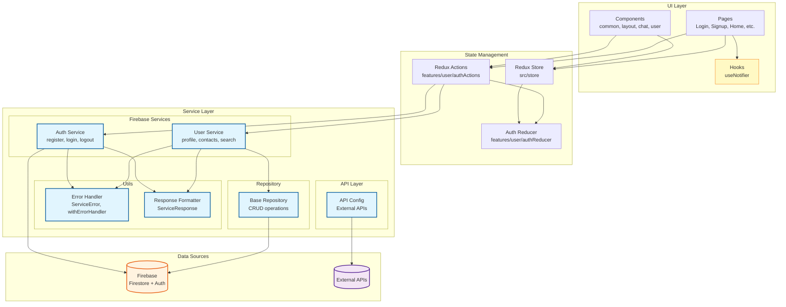

```mermaid
graph TB
    subgraph "UI Layer"
        C[Components<br/>common, layout, chat, user]
        P[Pages<br/>Login, Signup, Home, etc.]
        H[Hooks<br/>useNotifier]
    end

    subgraph "State Management"
        R[Redux Store<br/>src/store]
        A[Redux Actions<br/>features/user/authActions]
        AR[Auth Reducer<br/>features/user/authReducer]
    end

    subgraph "Service Layer"
        subgraph "Firebase Services"
            AS[Auth Service<br/>register, login, logout]
            US[User Service<br/>profile, contacts, search]
        end

        subgraph "Repository"
            BR[Base Repository<br/>CRUD operations]
        end

        subgraph "Utils"
            EH[Error Handler<br/>ServiceError, withErrorHandler]
            RF[Response Formatter<br/>ServiceResponse]
        end

        subgraph "API Layer"
            API[API Config<br/>External APIs]
        end
    end

    subgraph "Data Sources"
        FB[(Firebase<br/>Firestore + Auth)]
        EXT[(External APIs)]
    end

    %% UI Layer connections
    C --> R
    C --> A
    P --> R
    P --> A
    P --> H

    %% State Management connections
    A --> AS
    A --> US
    R --> AR
    A --> AR

    %% Service Layer connections
    AS --> FB
    US --> BR
    BR --> FB
    API --> EXT

    %% Utils connections
    AS --> EH
    US --> EH
    AS --> RF
    US --> RF

    %% Styling
    classDef serviceLayer fill:#e1f5fe,stroke:#01579b,stroke-width:2px
    classDef firebase fill:#fff3e0,stroke:#e65100,stroke-width:2px
    classDef external fill:#f3e5f5,stroke:#4a148c,stroke-width:2px
    classDef note fill:#fff9c4,stroke:#f57f17,stroke-width:1px

    %% Apply styles
    class AS,US,BR,EH,RF,API serviceLayer
    class FB firebase
    class EXT external
    class H note
```
