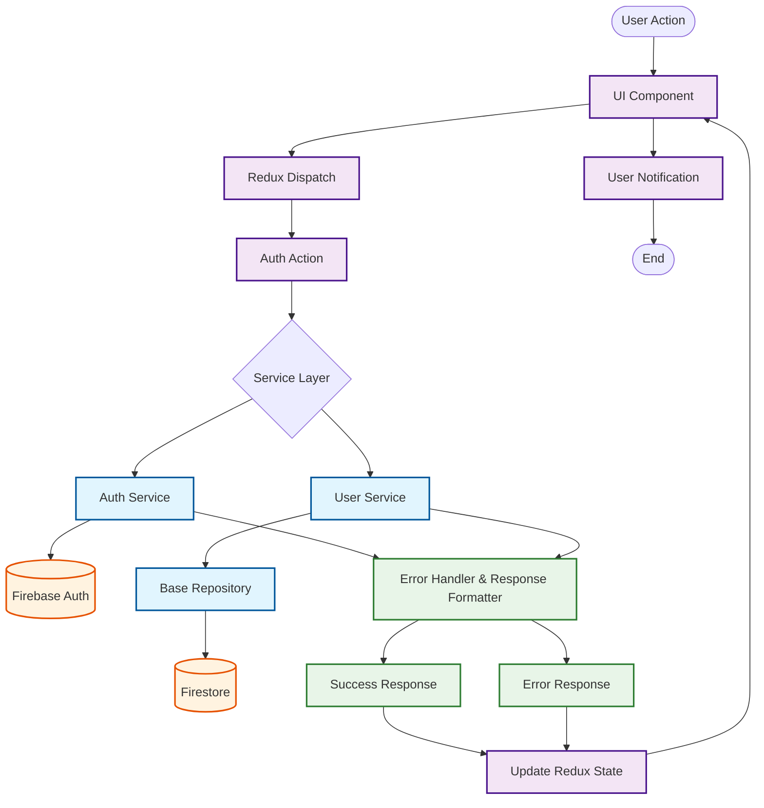

# Service Flow Architecture



## Service Flow Steps

### 1. User Interaction

- User performs action (login, signup, etc.)
- Component dispatches Redux action

### 2. Redux Layer

- Action creator receives parameters
- Calls appropriate service method

### 3. Service Layer

- **Auth Service**: Authentication operations
- **User Service**: User profile operations
- Uses Base Repository for Firestore operations

### 4. Data Layer

- Firebase Auth for authentication
- Firestore for user data storage

### 5. Response Handling

- Services format responses consistently
- Error handling with custom ServiceError
- Success/Error responses returned

### 6. State Update

- Redux state updated with response
- Components re-render with new state
- User notifications displayed

## Key Benefits

- **Separation of Concerns**: Clear responsibility boundaries
- **Consistent Error Handling**: Standardized error responses
- **Reusable Services**: Services can be used across components
- **Testable**: Easy to unit test business logic

---

# 📚 BaseRepository Documentation

## 🎯 **Mục đích**

BaseRepository cung cấp **CRUD operations cơ bản** cho tất cả Firestore collections, giúp:

- Standardize database operations
- Reduce code duplication
- Consistent error handling
- Easy to extend và customize

## 🏗️ **Cấu trúc**

```javascript
// src/service/repository/base.repository.js
export class BaseRepository {
  constructor(collectionName) {
    this.collectionName = collectionName;
    this.collectionRef = collection(db, collectionName);
  }

  // Methods...
}
```

## 📋 **Available Methods**

### 1. **findById(id)** - Tìm document theo ID

```javascript
const user = await userRepo.findById('user123');
console.log(user); // { id: 'user123', name: 'John', email: 'john@email.com' }
```

### 2. **findAll(options)** - Lấy tất cả documents

```javascript
// Basic usage
const users = await userRepo.findAll();

// With options
const users = await userRepo.findAll({
  orderByField: 'createdAt',
  orderDirection: 'desc',
  limitCount: 50,
});
```

### 3. **findByField(fieldName, value, options)** - Tìm theo field cụ thể

```javascript
// Find by email
const users = await userRepo.findByField('email', 'john@email.com');

// Find with options
const activeUsers = await userRepo.findByField('status', 'active', {
  orderByField: 'lastSeen',
  orderDirection: 'desc',
  limitCount: 20,
});
```

### 4. **create(data)** - Tạo document mới

```javascript
const newUser = await userRepo.create({
  name: 'John Doe',
  email: 'john@email.com',
  status: 'active',
});
// Tự động thêm createdAt và updatedAt
```

### 5. **update(id, data)** - Cập nhật document

```javascript
const updatedUser = await userRepo.update('user123', {
  name: 'John Smith',
  status: 'inactive',
});
// Tự động update updatedAt timestamp
```

### 6. **delete(id)** - Xóa document

```javascript
const result = await userRepo.delete('user123');
console.log(result); // { id: 'user123', deleted: true }
```

### 7. **exists(id)** - Kiểm tra document có tồn tại

```javascript
const userExists = await userRepo.exists('user123');
console.log(userExists); // true/false
```

## 🔧 **Cách sử dụng trong Services**

### **Extend BaseRepository:**

```javascript
// src/service/firebase/user.service.js
import { BaseRepository } from '../repository/base.repository';

class UserService extends BaseRepository {
  constructor() {
    super('users'); // Collection name
  }

  // Custom methods using BaseRepository
  async getUsersByStatus(status) {
    return this.findByField('status', status);
  }

  async createUserProfile(uid, userData) {
    return this.create({
      uid,
      ...userData,
      status: 'active',
    });
  }
}

export const userService = new UserService();
```

### **Composition (không extend):**

```javascript
// src/service/firebase/post.service.js
import { BaseRepository } from '../repository/base.repository';

class PostService {
  constructor() {
    this.postRepo = new BaseRepository('posts');
    this.commentRepo = new BaseRepository('comments');
  }

  async createPost(postData) {
    return this.postRepo.create(postData);
  }

  async getPostComments(postId) {
    return this.commentRepo.findByField('postId', postId);
  }
}
```

---

# Hướng dẫn tạo Service mới

## **Ví dụ: Tạo Avatar Service (Base64)**

### **Step 1: Tạo file service**

```javascript
// src/service/firebase/avatar.service.js
import { BaseRepository } from '../repository/base.repository';
import {
  ServiceError,
  ErrorCodes,
  withErrorHandler,
} from '../utils/error-handler';
import { ServiceResponse } from '../utils/response-formatter';

// Avatar service specific messages
const AVATAR_MESSAGES = {
  UPLOAD_SUCCESS: 'avatar.upload_success',
  UPDATE_SUCCESS: 'avatar.update_success',
  DELETE_SUCCESS: 'avatar.delete_success',
  FILE_REQUIRED: 'avatar.file_required',
  INVALID_FILE_TYPE: 'avatar.invalid_file_type',
  FILE_TOO_LARGE: 'avatar.file_too_large',
  AVATAR_NOT_FOUND: 'avatar.not_found',
  INVALID_BASE64: 'avatar.invalid_base64',
};

class AvatarService extends BaseRepository {
  constructor() {
    super('avatars'); // Firestore collection để lưu avatar base64
    this.allowedTypes = [
      'image/jpeg',
      'image/jpg',
      'image/png',
      'image/gif',
      'image/webp',
    ];
    this.maxFileSize = 500 * 1024; // 500KB - Giới hạn nhỏ cho avatar
  }

  /**
   * Convert file to base64
   */
  fileToBase64 = (file) => {
    return new Promise((resolve, reject) => {
      const reader = new FileReader();
      reader.readAsDataURL(file);
      reader.onload = () => resolve(reader.result);
      reader.onerror = (error) => reject(error);
    });
  };

  /**
   * Validate base64 string
   */
  isValidBase64 = (str) => {
    try {
      return btoa(atob(str)) === str;
    } catch (err) {
      return false;
    }
  };

  /**
   * Upload/Update user avatar
   */
  uploadAvatar = withErrorHandler(async (file, userId) => {
    // Validation
    if (!file) {
      throw new ServiceError(
        AVATAR_MESSAGES.FILE_REQUIRED,
        ErrorCodes.INVALID_INPUT,
        400,
      );
    }

    if (!this.allowedTypes.includes(file.type)) {
      throw new ServiceError(
        AVATAR_MESSAGES.INVALID_FILE_TYPE,
        ErrorCodes.INVALID_INPUT,
        400,
      );
    }

    if (file.size > this.maxFileSize) {
      throw new ServiceError(
        AVATAR_MESSAGES.FILE_TOO_LARGE,
        ErrorCodes.INVALID_INPUT,
        400,
      );
    }

    // Convert to base64
    const base64String = await this.fileToBase64(file);

    // Prepare avatar data
    const avatarData = {
      userId,
      fileName: file.name,
      fileType: file.type,
      fileSize: file.size,
      base64Data: base64String,
      isActive: true,
    };

    // Check if user already has avatar
    const existingAvatars = await this.findByField('userId', userId);

    let result;
    if (existingAvatars.length > 0) {
      // Update existing avatar
      const existingAvatar = existingAvatars[0];
      result = await this.update(existingAvatar.id, avatarData);

      return ServiceResponse.success(
        {
          id: result.id,
          base64Data: result.base64Data,
          isUpdate: true,
        },
        AVATAR_MESSAGES.UPDATE_SUCCESS,
      );
    } else {
      // Create new avatar
      result = await this.create(avatarData);

      return ServiceResponse.success(
        {
          id: result.id,
          base64Data: result.base64Data,
          isUpdate: false,
        },
        AVATAR_MESSAGES.UPLOAD_SUCCESS,
      );
    }
  });

  /**
   * Upload avatar from base64 string
   */
  uploadAvatarFromBase64 = withErrorHandler(
    async (base64String, userId, fileName = 'avatar.png') => {
      // Validation
      if (!base64String) {
        throw new ServiceError(
          AVATAR_MESSAGES.FILE_REQUIRED,
          ErrorCodes.INVALID_INPUT,
          400,
        );
      }

      // Extract file info from base64
      const matches = base64String.match(/^data:([A-Za-z-+\/]+);base64,(.+)$/);
      if (!matches || matches.length !== 3) {
        throw new ServiceError(
          AVATAR_MESSAGES.INVALID_BASE64,
          ErrorCodes.INVALID_INPUT,
          400,
        );
      }

      const fileType = matches[1];
      const base64Data = matches[2];

      // Validate file type
      if (!this.allowedTypes.includes(fileType)) {
        throw new ServiceError(
          AVATAR_MESSAGES.INVALID_FILE_TYPE,
          ErrorCodes.INVALID_INPUT,
          400,
        );
      }

      // Estimate file size (base64 is ~33% larger than original)
      const estimatedSize = (base64Data.length * 3) / 4;
      if (estimatedSize > this.maxFileSize) {
        throw new ServiceError(
          AVATAR_MESSAGES.FILE_TOO_LARGE,
          ErrorCodes.INVALID_INPUT,
          400,
        );
      }

      // Prepare avatar data
      const avatarData = {
        userId,
        fileName,
        fileType,
        estimatedSize: Math.round(estimatedSize),
        base64Data: base64String,
        isActive: true,
      };

      // Check if user already has avatar
      const existingAvatars = await this.findByField('userId', userId);

      let result;
      if (existingAvatars.length > 0) {
        // Update existing avatar
        const existingAvatar = existingAvatars[0];
        result = await this.update(existingAvatar.id, avatarData);

        return ServiceResponse.success(
          {
            id: result.id,
            base64Data: result.base64Data,
            isUpdate: true,
          },
          AVATAR_MESSAGES.UPDATE_SUCCESS,
        );
      } else {
        // Create new avatar
        result = await this.create(avatarData);

        return ServiceResponse.success(
          {
            id: result.id,
            base64Data: result.base64Data,
            isUpdate: false,
          },
          AVATAR_MESSAGES.UPLOAD_SUCCESS,
        );
      }
    },
  );

  /**
   * Get user avatar
   */
  getUserAvatar = withErrorHandler(async (userId) => {
    const avatars = await this.findByField('userId', userId, {
      orderByField: 'updatedAt',
      orderDirection: 'desc',
      limitCount: 1,
    });

    if (avatars.length === 0) {
      return ServiceResponse.success(null);
    }

    const avatar = avatars[0];
    return ServiceResponse.success({
      id: avatar.id,
      base64Data: avatar.base64Data,
      fileName: avatar.fileName,
      fileType: avatar.fileType,
      updatedAt: avatar.updatedAt,
    });
  });

  /**
   * Delete user avatar
   */
  deleteAvatar = withErrorHandler(async (userId) => {
    const avatars = await this.findByField('userId', userId);

    if (avatars.length === 0) {
      throw new ServiceError(
        AVATAR_MESSAGES.AVATAR_NOT_FOUND,
        ErrorCodes.DOCUMENT_NOT_FOUND,
        404,
      );
    }

    // Delete all avatars for user (should be only one)
    const deletePromises = avatars.map((avatar) => this.delete(avatar.id));
    await Promise.all(deletePromises);

    return ServiceResponse.success(
      { userId, deletedCount: avatars.length },
      AVATAR_MESSAGES.DELETE_SUCCESS,
    );
  });

  /**
   * Get all avatars (admin function)
   */
  getAllAvatars = withErrorHandler(async (options = {}) => {
    const avatars = await this.findAll({
      orderByField: 'createdAt',
      orderDirection: 'desc',
      limitCount: 50,
      ...options,
    });

    // Return without base64 data for performance
    const avatarsMetadata = avatars.map((avatar) => ({
      id: avatar.id,
      userId: avatar.userId,
      fileName: avatar.fileName,
      fileType: avatar.fileType,
      fileSize: avatar.fileSize || avatar.estimatedSize,
      createdAt: avatar.createdAt,
      updatedAt: avatar.updatedAt,
    }));

    return ServiceResponse.success(avatarsMetadata);
  });
}

// Export singleton
export const avatarService = new AvatarService();
```

### **Step 2: Thêm vào index.js**

```javascript
// src/service/index.js
export { avatarService } from './firebase/avatar.service';
```

### **Step 3: Thêm Message Constants**

```javascript
// src/constants/Message.js
export const SUCCESS = {
  // ... existing messages
  AVATAR_UPLOAD_SUCCESS: 'success.avatar_upload',
  AVATAR_UPDATE_SUCCESS: 'success.avatar_update',
  AVATAR_DELETE_SUCCESS: 'success.avatar_delete',
};

export const ERROR = {
  // ... existing messages
  AVATAR_FILE_REQUIRED: 'error.avatar_file_required',
  AVATAR_INVALID_TYPE: 'error.avatar_invalid_type',
  AVATAR_TOO_LARGE: 'error.avatar_too_large',
  AVATAR_NOT_FOUND: 'error.avatar_not_found',
  AVATAR_INVALID_BASE64: 'error.avatar_invalid_base64',
};
```

### **Step 4: Thêm Redux Actions (nếu cần)**

```javascript
// features/user/userActions.js (hoặc tạo features/avatar/avatarActions.js)
import { createAsyncThunk } from '@reduxjs/toolkit';
import { avatarService } from '../../src/service';

export const uploadAvatar = createAsyncThunk(
  'user/uploadAvatar',
  async ({ file, userId }, { rejectWithValue }) => {
    try {
      const response = await avatarService.uploadAvatar(file, userId);
      return response.data;
    } catch (error) {
      return rejectWithValue({
        messageKey: error.message,
        code: error.code,
        statusCode: error.statusCode,
      });
    }
  },
);

export const uploadAvatarFromBase64 = createAsyncThunk(
  'user/uploadAvatarFromBase64',
  async ({ base64String, userId, fileName }, { rejectWithValue }) => {
    try {
      const response = await avatarService.uploadAvatarFromBase64(
        base64String,
        userId,
        fileName,
      );
      return response.data;
    } catch (error) {
      return rejectWithValue({
        messageKey: error.message,
        code: error.code,
        statusCode: error.statusCode,
      });
    }
  },
);

export const getUserAvatar = createAsyncThunk(
  'user/getUserAvatar',
  async (userId, { rejectWithValue }) => {
    try {
      const response = await avatarService.getUserAvatar(userId);
      return response.data;
    } catch (error) {
      return rejectWithValue({
        messageKey: error.message,
        code: error.code,
        statusCode: error.statusCode,
      });
    }
  },
);

export const deleteAvatar = createAsyncThunk(
  'user/deleteAvatar',
  async (userId, { rejectWithValue }) => {
    try {
      const response = await avatarService.deleteAvatar(userId);
      return response.data;
    } catch (error) {
      return rejectWithValue({
        messageKey: error.message,
        code: error.code,
        statusCode: error.statusCode,
      });
    }
  },
);
```

### **Step 5: Sử dụng trong Components**

```javascript
// src/components/AvatarUpload.jsx
import React, { useState, useEffect } from 'react';
import { useDispatch, useSelector } from 'react-redux';
import { uploadAvatar, getUserAvatar } from '../../features/user/userActions';

const AvatarUpload = ({ userId }) => {
  const dispatch = useDispatch();
  const { loading } = useSelector((state) => state.user);
  const [currentAvatar, setCurrentAvatar] = useState(null);
  const [preview, setPreview] = useState(null);

  // Load current avatar
  useEffect(() => {
    if (userId) {
      dispatch(getUserAvatar(userId))
        .unwrap()
        .then((avatar) => {
          if (avatar) {
            setCurrentAvatar(avatar.base64Data);
          }
        });
    }
  }, [userId, dispatch]);

  const handleFileUpload = async (event) => {
    const file = event.target.files[0];
    if (!file) return;

    // Show preview
    const reader = new FileReader();
    reader.onload = (e) => setPreview(e.target.result);
    reader.readAsDataURL(file);

    try {
      const result = await dispatch(uploadAvatar({ file, userId })).unwrap();

      // Update current avatar
      setCurrentAvatar(result.base64Data);
      setPreview(null);

      // Success handled by Redux state
    } catch (error) {
      // Error handled by Redux state
      setPreview(null);
    }
  };

  return (
    <div className="avatar-upload">
      <div className="avatar-display">
        {preview || currentAvatar ? (
          
        ) : (
          <div className="flex h-24 w-24 items-center justify-center rounded-full bg-gray-300">
            <span>No Avatar</span>
          </div>
        )}
      </div>

      <input
        type="file"
        accept="image/*"
        onChange={handleFileUpload}
        disabled={loading}
        className="mt-2"
      />

      {loading && <p>Uploading avatar...</p>}
    </div>
  );
};

export default AvatarUpload;
```

### **💡 Sử dụng trực tiếp Service (không qua Redux)**

```javascript
// src/components/SimpleAvatarUpload.jsx
import React, { useState } from 'react';
import { avatarService } from '../service';
import useNotifier from '../hooks/useNotifier';

const SimpleAvatarUpload = ({ userId }) => {
  const [loading, setLoading] = useState(false);
  const [avatar, setAvatar] = useState(null);
  const notify = useNotifier();

  const handleFileUpload = async (event) => {
    const file = event.target.files[0];
    if (!file) return;

    setLoading(true);
    try {
      const response = await avatarService.uploadAvatar(file, userId);
      setAvatar(response.data.base64Data);
      notify(response.message, 'success');
    } catch (error) {
      notify(error.message, 'error');
    } finally {
      setLoading(false);
    }
  };

  return (
    <div>
      {avatar && (
        
      )}
      <input
        type="file"
        accept="image/*"
        onChange={handleFileUpload}
        disabled={loading}
      />
    </div>
  );
};
```

## **Service Creation Checklist**

### **Chuẩn bị:**

- [ ] Xác định business logic cần thiết
- [ ] Quyết định extend BaseRepository hay composition
- [ ] Define message constants
- [ ] Plan error handling strategy

### **Implementation:**

- [ ] Tạo service class với proper constructor
- [ ] Implement core methods với `withErrorHandler`
- [ ] Return `ServiceResponse` format
- [ ] Add proper validation
- [ ] Handle edge cases

### **Integration:**

- [ ] Export service trong `index.js`
- [ ] Add message constants
- [ ] Create Redux actions (nếu cần)
- [ ] Write usage examples
- [ ] Test các methods

### **Documentation:**

- [ ] Comment cho methods
- [ ] Usage examples
- [ ] Error scenarios
- [ ] Performance considerations

## 🎯 **Best Practices cho Service mới:**

1. **Always use `withErrorHandler`** - Consistent error handling
2. **Return `ServiceResponse`** - Standardized response format
3. **Validate inputs** - Check required parameters
4. **Use BaseRepository** - Leverage common CRUD operations
5. **Define message constants** - i18n support
6. **Write unit tests** - Test business logic
7. **Document methods** - Clear usage examples

Với pattern này, bạn có thể tạo bất kỳ service nào: `NotificationService`, `ChatService`, `PaymentService`, etc.
